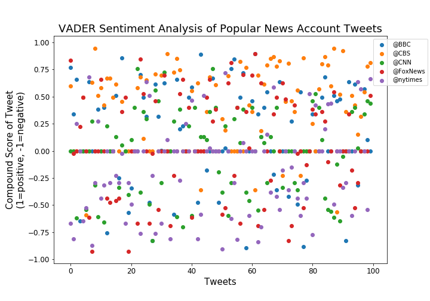
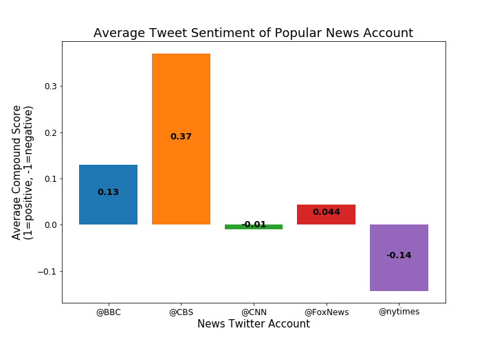

## Unit 7 | Assignment - Distinguishing Sentiments

## News Mood

In this assignment, I created a Python script to perform a sentiment analysis of the Twitter activity of the news oulets __BBC, CBS, CNN, Fox, and New York times__ ,and created plots to show my findings.

I utilized the twitter API to gather the tweets from the news twitter profiles and used the VADER python package to analyze the tweets. 

## I generated the plots below:

* A scatter plot of sentiments of the last __100__ tweets sent out by each news organization, ranging from -1.0 to 1.0, where a score of 0 expresses a neutral sentiment, -1 the most negative sentiment possible, and +1 the most positive sentiment possible.

* A bar plot visualizing the _overall_ sentiments of the last 100 tweets from each organization. For this plot, you will again aggregate the compound sentiments analyzed by VADER.

## My solution can be found here:

[VADER_analysis](VADER_analysis/)